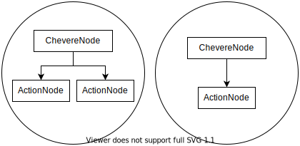

Chevere's Docs
==============

## About **Chevere**

Chevere was inspired in *[Alpine.js](https://github.com/alpinejs/alpine)* in terms of simplicity and in *[Vue.js](https://github.com/vuejs/vue)* in terms of syntax

If you've worked with some [or both] of those frameworks, the thing will be easier for you

Chevere works at the same way as the DOM, ``ChevereNodes`` have ``ActionNodes``, and together, they make a 'tree' with their own data



Of course, *data* is reusable, multiple ``ChevereNode`` instances can have the same 'blueprint data' so to speak, for instance...

```html
<div id="one" data-attached="test">
    <span data-text="this.data.msg"></span>
</div>
<div id="two" data-attached="test">
    <span data-text="this.data.msg"></span>
</div>
<script>
    Chevere.search({
        name: "test",
        data: {
            msg: "Hello world"
        }
    })
</script>
```

If the data of ``div#one`` changes, it won't affect the data of ``div#two``, because both elements are completely different instances

Chevere has two kind of nodes, ``Inline`` nodes, and ``Attached`` nodes

``Inline`` nodes have their **own** data, then **is not shareable**. They're defined with the ``data-inline`` attribute, for instance...

```html
<div data-inline="{ data: { msg: 'Hola mundo'} }">
    <span data-text="this.data.msg"></span>
</div>
```

``Attached`` nodes are part of a common 'blueprint' data, they can be defined with the ``data-attached`` attribute, for instance...

```html
<div data-attached="test">
    <span data-text="this.data.msg"></span>
</div>
```

``Attached`` nodes can also be defined with the *``Chevere.make``* function (Preferred way), for instance...

```html
<div>
    <span data-text="this.data.msg"></span>
</div>
<div>
    <span data-text="this.data.msg"></span>
</div>
<script>
    const nodes = document.querySelectorAll("div");

    Chevere.make({
        data: {
            msg: "Hello world"
        }
    }, ...nodes)
</script>
```
Perhaps, this gonna sounds a little weird to you, but we like to call ``Chevere`` as an ***Attribute oriented framework***, because all the propierties of a ``ChevereNode`` are defined by the appropiates *`data-`* attributes.

# Let's start

## Index
| Page | Description |
| ------- | ----------- |
| [`Defining the data`](./data.md)| How to create a reusable and functional data|
| [`Lifecycle`](./lifecycle.md)| About *``init``*, *``updating``* and *``updated``* |
