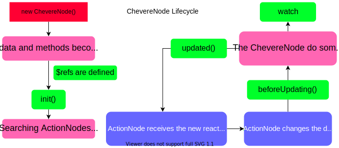

Lifecycle
=========

### Let's see the following diagram about the Lifecycle of a ``ChevereNode``



### Let's dive into this:

1. At first, a ``new ChevereNode()`` is instantiated
2. Then, ``data`` and ``methods`` become reactive
3. At this point, ``$refs`` are defined...
5. ...and ``init`` method is called, even if it was an ``async()`` function
6. After that, the ``ChevereNode`` can search ``ActionNodes``...
7. ...and pass to them the reactive data

### Ok, when a change happens...

1. The change is emited from the ``ActionNode`` to the ``ChevereNode``
2. That last one, listen to the change, at this moment, ``beforeUpdating()`` is called
3. Now, the ``ChevereNode`` can do something with the chage, while this happens, all ``watch`` functions are called
4. After these proccess, ``updated()`` is called...
5. ...and then, The ``ChevereNode`` pass to the child the new ``data``

# init()

The init() method is used to execute some code after the ``data`` has become reactive. It can be an ``async()`` function

***Important: Some ``methods`` can be ``async()``, but the ``beforeUpdating()``, ``updated()`` and ``watch`` methods cannot***

An example of this:

```html
<div data-inline="{
    data: {
        msg: 'Hello world'
    },
    init() {
        this.data.msg = 'Chevere'
    }
}">
    <span data-text="this.data.msg"></span>
</div>
<script>
    Chevere.search();
</script>
```

The ``span`` will have as **textContent** 'Chevere'

***What can I do if I wanted to pass some arguments to it?***, well, you can add an extra attribute to the element, *``data-init``*, then...

```html
<div data-inline="{
    data: {
        msg: 'Hello world'
    },
    init(arg) {
        this.data.msg = arg
    }
}" data-init="'Chevere'">
    <span data-text="this.data.msg"></span>
</div>
<script>
    Chevere.search();
</script>
```

The same result of the above example will happen

# beforeUpdating() and updated()

Consider the following example:

```javascript
const data = {
    data: {
        msg: 'Hello world'
    },
    beforeUpdating() {
        console.log("before")
    },
    updated() {
        console.log("after");
    }
}
```

It some ``ActionNode`` makes a change to ``msg``, ``"before"`` is logged on the ``console``, then, ``"after"`` is logged on it

### The next guide is about the [*data-* attributes](./attributes.md), let's go!